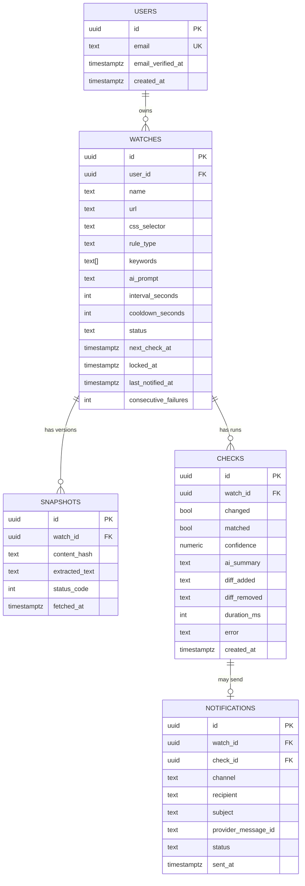

# Data model

Agree on this in hour 1. Once it is committed, frontend and backend can work in parallel against it without talking.



## Schema

```sql
create extension if not exists "pgcrypto";

create table users (
  id                uuid primary key default gen_random_uuid(),
  email             text not null unique,
  email_verified_at timestamptz,
  created_at        timestamptz not null default now()
);

-- rule_type: 'any_change' | 'keyword_appears' | 'keyword_disappears' | 'regex' | 'ai'
-- status:    'warming' | 'active' | 'paused' | 'failing' | 'blocked'
create table watches (
  id                   uuid primary key default gen_random_uuid(),
  user_id              uuid not null references users(id) on delete cascade,
  name                 text not null,
  url                  text not null,
  css_selector         text,
  rule_type            text not null default 'any_change',
  keywords             text[] not null default '{}',
  ai_prompt            text,
  interval_seconds     int  not null default 300 check (interval_seconds >= 60),
  cooldown_seconds     int  not null default 3600,
  status               text not null default 'warming',
  next_check_at        timestamptz not null default now(),
  locked_at            timestamptz,
  last_notified_at     timestamptz,
  consecutive_failures int  not null default 0,
  created_at           timestamptz not null default now()
);

-- the index the whole scheduler depends on
create index watches_due_idx on watches (next_check_at)
  where status in ('active','warming','failing');

create table snapshots (
  id             uuid primary key default gen_random_uuid(),
  watch_id       uuid not null references watches(id) on delete cascade,
  content_hash   text not null,
  extracted_text text not null,
  status_code    int,
  fetched_at     timestamptz not null default now()
);
create index snapshots_watch_idx on snapshots (watch_id, fetched_at desc);

create table checks (
  id            uuid primary key default gen_random_uuid(),
  watch_id      uuid not null references watches(id) on delete cascade,
  changed       boolean not null default false,
  matched       boolean not null default false,
  confidence    numeric(3,2),
  ai_summary    text,
  diff_added    text,
  diff_removed  text,
  status_code   int,
  duration_ms   int,
  error         text,
  created_at    timestamptz not null default now()
);
create index checks_watch_idx on checks (watch_id, created_at desc);

create table notifications (
  id                  uuid primary key default gen_random_uuid(),
  watch_id            uuid not null references watches(id) on delete cascade,
  check_id            uuid references checks(id) on delete set null,
  channel             text not null default 'email',
  recipient           text not null,
  subject             text not null,
  provider_message_id text,
  status              text not null default 'queued',
  sent_at             timestamptz
);
```

## Storage discipline

`snapshots.extracted_text` is the row that will blow up your free-tier database. Two rules:

1. **Only insert a snapshot when the hash changed.** Unchanged checks write a `checks` row (tiny) and nothing else.
2. Keep the last 10 snapshots per watch. Prune inside the same transaction:

```sql
delete from snapshots
where watch_id = $1
  and id not in (
    select id from snapshots where watch_id = $1
    order by fetched_at desc limit 10
  );
```

## Claiming due watches

This is the query that makes concurrent cron ticks safe. Two overlapping runners will never pick the same watch.

```sql
update watches w
set locked_at = now(),
    next_check_at = now() + (interval_seconds || ' seconds')::interval
from (
  select id from watches
  where status in ('active','warming','failing')
    and next_check_at <= now()
    and (locked_at is null or locked_at < now() - interval '5 minutes')
  order by next_check_at
  limit 25
  for update skip locked
) due
where w.id = due.id
returning w.*;
```

Note it advances `next_check_at` at claim time, not after the check completes — a crashed runner cannot wedge a watch into a hot loop. The 5-minute `locked_at` clause reclaims watches orphaned by a crash.

## Seed data for development

Have a `npm run seed` that creates one user, five watches in mixed states, and ~200 fake `checks` rows spread over 48 hours. An empty dashboard is impossible to design against and looks dead on the projector.
